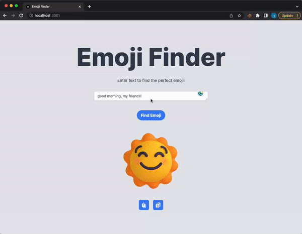

# Emoji Predictor with BERTweet

## Live Demo



## Description

This project is focused on the relationship between text data and emojis. Using a fine-tuned version of the state-of-the-art model BERTweet, we've managed to improve top-1 accuracy by 10%. The dataset used for this study was developed uniquely for this task by scraping tweets and prompting the GPT 3.5 Turbo API for emoji prediction.

The application is built using Next.js for the frontend and Flask for the backend. It maps Unicode emojis to Microsoft's animated Fluent Emojis.

## Getting Started

Follow these instructions to get a copy of the project up and running on your local machine for development and testing purposes.

### Prerequisites

- Node.js (Download and Install from [here](https://nodejs.org/))
- Python 3 (Download and Install from [here](https://www.python.org/downloads/))
- Flask (Python Web Framework)
- Pip (Python Package Installer)
- Download the BERTweet model from [here](https://drive.google.com/drive/folders/1jy_YjV1HytxvOZKIdZ8D0i8nd2q1IU_9?usp=sharing) and place it in the backend directory.

### Installation

1. Clone the repository:

   ```bash
   https://github.com/itsEricWu/emoji-predictor-web.git
   cd emoji-predictor-web
   ```

2. Install Flask and the necessary Python packages using pip:

   ```bash
   pip install -r requirements.txt
   ```

3. Navigate to the frontend directory:

   ```bash
   cd frontend
   ```

4. Install the required Node packages:
   ```bash
   npm install
   ```

## Running the Application

1. Start the Flask server:
   Navigate to the backend directory and run:

   ```bash
   cd ../backend
   python3 app.py
   ```

   The server should now be running on [http://localhost:5000](http://localhost:5000).

2. Start the Next.js application:
   In a new terminal, navigate to the frontend directory and run:

   ```bash
   cd frontend
   npm run dev
   ```

   The application should now be running on [http://localhost:3000](http://localhost:3000).
